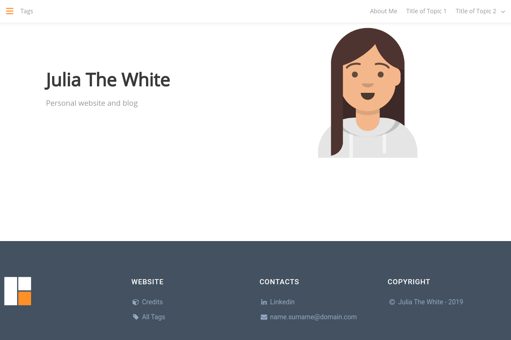

# The ReFresh theme for Hugo

**ReFresh** is a theme for the [Hugo](https://gohugo.io) static site generator _highly_ modified from the awesome [Fresh](https://github.com/StefMa/hugo-fresh) theme (below you can find the list of changes to the original theme). 

You can find a live demo of the original Fresh theme [here](https://themes.gohugo.io/theme/hugo-fresh/) or a demo of the Hugo ReFresh theme [here](https://themes.gohugo.io/theme/hugo-refresh/).

You can find another example of ReFresh theme in [my personal website](https://rjordaney.is/). 



> This theme is intended for personal website and blog. If you'd like to extend the theme to include other functionalities submit a pull request.

## Getting started

To create a new site using Hugo ReFresh:

```bash
# Create site and cd into it
hugo new site my-site && cd my-site

# Clone the ReFresh theme into the themes folder
git init
git submodule add https://github.com/PippoRJ/hugo-refresh.git themes/hugo-refresh

# Remove the default config
rm config.toml

# Fetch the example config
curl -O https://raw.githubusercontent.com/PippoRJ/hugo-refresh/master/exampleSite/config.yaml

# Run the site locally
hugo server -D

# Open the site in your browser
open http://localhost:1313
```

To run the Example Site using Hugo ReFresh:

```bash
# Create site and cd into it
hugo new site my-site && cd my-site

# Clone the ReFresh theme into the themes folder
git init
git submodule add https://github.com/PippoRJ/hugo-refresh themes/hugo-refresh

# Remove the default config
rm config.toml

# Copy the Example site content and configuration in my-site
cp -R themes/hugo-refresh/exampleSite/* ./

# Open the site in your browser
hugo server -D
```

## Troubleshooting

If you see `error: failed to transform resource: TOCSS: failed to transform "style.sass"` when attempting to run your `hugo server`, make sure you have the extended version of Hugo installed:

```bash
# On Ubuntu:
snap refresh hugo --channel=extended
```

## Statistics counter

You can enter your Google / Yandex / etc statistic counter code into the `layouts/partials/counter.html`. Code will be generated right after open `<body>` tag.

## Custom HEAD

If you want to include custom scripts at the end of the `HEAD` section, create a file in `layouts/partials/custom_head.html` and add your content there.

## Customizing your page

There are different configuration options for Hugo ReFresh including options for: the navbar, the sidebar, the homepage, fonts, colours landing, stats counters and images. 
Read the comments in the `config.yaml` file to know more.

The images specified in the `config.yaml` file need to be placed in the directory specified by the `assetDir` option in the config file. 
E.g.: set `assetDir: "static"` to the set the default folder the `static` folder of your site. 

## List of shortcodes you can use in your articles with description:

A live example of these shortcodes can be found [here](https://rjordaney.is/miscellaneous/example/).

<details>
<summary> title1.html, title2.html, title3.html, title4.html, title5.html, title6.html </summary>

Usage example:

```

```

The **first parameter** is the title of the shortcode (in this example is "My awesome title").<br>
The **second paramter** is the ID of the shortcode (in this example is "my-title-id").<br>
It can be used in links to the same page as:

```
[link to the title](#my-title-id)
```

</details>

<details>
<summary> subtitle1.html, subtitle2.html, subtitle3.html, subtitle4.html, subtitle5.html, subtitle6.html </summary>

Usage example:

```

```

The **first parameter** is the title of the shortcode (in this example is "My awesome subtitle").<br>
The **second paramter** is the ID of the shortcode (in this example is "my-subtitle-id").<br>
It can be used in links to the same page as:

```
[link to the subtitle](#my-subtitle-id)
```

</details>

<details>
<summary> code.html </summary>

This shortcode builds a centred page that is two-third of the full size of the page.

Usage example:

```

    $ sudo bash -c 'echo 0 > /proc/sys/kernel/randomize_va_space'

```

This shortcode has 2 parameters:

* **line-numbers** to hide or show the line numbers. The default is true, for single line code the number is never shown.

* **language** is used to highlight the syntax of the code properly

</details>

<details>
<summary> codeWide.html </summary>

This shortcode builds a centred page that is as wide as the full size of the page.

Usage example:

```

    $ dmesg | tail
    ......
    [13401.299114] overflow64[16566]: segfault at 616161616161 ip 0000616161616161 sp 00007fffffffddb0 error 14 in libc-2.27.so[7ffff79e4000+1e7000]

```

This shortcode has 2 parameters:

* **line-numbers** to hide or show the line numbers. The default is true, for single line code the number is never shown.

* **language** is used to highlight the syntax of the code properly

</details>

<details>
<summary> container.html </summary>

This shortcode builds a centred page that is as wide as the two third of the size of the page. The content of the shortcode will pass through the markdown processor.

Usage example:

```



```

This shortcode has an optional parameter to give an ID to the html `div`.

</details>

<details>
<summary> containerWide.html </summary>

This shortcode builds a centred page that is as wide as the size of the page. The content of the shortcode will pass through the markdown processor. 

Usage example:

```



```

This shortcode has an optional parameter to give an ID to the html `div`.

</details>

<details>
<summary> figure.html </summary>

This shortcode resize an image that with the width and/or height that you specify

Usage example:

```


```

The parameter **src** is the location of the image relative to the location of the file where the shortcode has been used.<br>
The parameter **width** is the width of the image.<br>
The parameter **height** is the height of the image.<br>
The parameter **caption** is the caption of the image.<br>
The parameter **alt** is the alt property of the image.<br>

</details>

<details>
<summary> twoFigure.html </summary>

This shortcode shows 2 images one next to the other with the possibility to resize them.

Usage example:

```

```

The parameter **src1** is the location of the right image relative to the location of the file where the shortcode has been used.<br>
The parameter **width1** is the width of the right image.<br>
The parameter **height1** is the height of the right image.<br>
The parameter **caption1** is the caption of the right image.<br>
The parameter **alt1** is the alt property of the right image.<br>
The parameter **src2** is the location of the left image relative to the location of the file where the shortcode has been used.<br>
The parameter **width2** is the width of the left image.<br>
The parameter **height2** is the height of the left image.<br>
The parameter **caption2** is the caption of the left image.<br>
The parameter **alt2** is the alt property of the left image.<br>


With a small screen these images will be shown one on top of the other.

See example of use [here](https://rjordaney.is/lectures/basic_buffer_overflow/)

</details>

<details>
<summary> twoVideos.html </summary>

This shortcode shows 2 YouTube videos one next to the other.

Usage example:

```
{}
```

The parameter **id1** is the ID of the left video<br>
The parameter **id2** is the ID of the right video<br>
The parameter **autoplay1** is used to start the video on the left (the video will start on mute). Set it to "true" to activate autoplay.<br>
The parameter **autoplay2** is used to start the video on the left (the video will start on mute). Set it to "true" to activate autoplay.<br>
The parameter **ratio1** is used to specify the the ratio of the video on the left. It can be either "16:9" or "4:3". The default is "16:9".<br>
The parameter **ratio2** is used to specify the the ratio of the video on the right. It can be either "16:9" or "4:3". The default is "16:9".<br>

With a small screen these videos will be shown one on top of the other.

</details>

<details>
<summary> book.html </summary>

Usage example:

```

```

The parameter **title** is the title of the book.<br>
The parameter **authors** contains the authors of the book.<br>
The parameter **image** is the cover of the book.<br>

The parameter **size** is used to specify the size of the book in pixel "width" x "height".<br>
E.g.: "300x" means 300px of width.<br> 
E.g.: "x300" means 300px of height. <br>

See example of use [here](https://rjordaney.is/miscellaneous/ml_books/)

</details>

<details>
<summary> exercise.html </summary>

Usage example:

```

Text of the exercise.

```

This shortcode has no parameters.

See example of use [here](https://rjordaney.is/code_exercises/staircase_n_steps/)

</details>


<details>
<summary> tabsCode.html </summary>

Usage example:

```

```

The parameter **file1** is the name of the code file to be displayed in the first tab.
The path needs to start from the `content` folder.<br>
The parameter **language1** is used to highlight the syntax of the code properly. 
The parameter **title1** is the title of the first tab.<br>
The parameter **icon1** is the icon to be shown at the right of the title, it is an optional parameter. See the partial code `icon.html` for the available icons.

There are 6 tabs supported at this moment

* the files parameters are **file1**, **file2**, **file3**, **file4**, **file5**, **file6** 

* the titles parameters are **title1**, **title2**, **title3**, **title4**, **title5**, **title6** 

* the languages parameters are **language1**, **language2**, **language3**, **language4**, **language5**, **language6**

* the icons parameters are **icon1**, **icon2**, **icon3**, **icon4**, **icon5**, **icon6** 

See example of use [here](https://rjordaney.is/code_exercises/staircase_n_steps/)

</details>

<details>
<summary> tabs.html </summary>

Usage example:

```

```

The content of the files (file1, file2 ...) are passed through the markdown processor, so you can use markdown in these files.

The parameter **file1** is the name of the code file to be displayed in the first tab.
The path needs to start from the `content` folder.<br>
The parameter **title1** is the title of the first tab.<br>
The parameter **icon1** is the icon to be shown at the right of the title, it is an optional parameter. See the partial code `icon.html` for the available icons.

There are 6 tabs supported at this moment

* the files parameters are **file1**, **file2**, **file3**, **file4**, **file5**, **file6** 

* the titles parameters are **title1**, **title2**, **title3**, **title4**, **title5**, **title6** 

* the icons parameters are **icon1**, **icon2**, **icon3**, **icon4**, **icon5**, **icon6** 

</details>

<details>
<summary> codeInLine.html </summary>

Usage example:

```
sudo echo 0 > /proc/sys/kernel/randomize_va_space
```

This shortcode has 2 parameters:

* **language** is used to highlight the syntax of the code properly

* **id** to set a id of the html `code` element

See an example of usage [here](https://rjordaney.is/lectures/basic_buffer_overflow/)

</details>

<details>
<summary> messageBlue.html, messageDark.html, messageGreen.html, messageRed.html, messageYellow.html </summary>


</details>

<details>
<summary> notificationBlue.html, notificationGreen.html, notificationRed.html, notificationYellow.html </summary>


</details>

<details>
<summary> siteBlue.html, siteGreen.html, siteLightgreen.html, siteRed.html, siteYellow.html </summary>

Usage example:

```

<p>Description of the website.</p>

```

The **first parameter** will appear in the right coloured part of the shortcode.<br>
The **second parameter** will appear in the middle part of the shortcode.<br>

See example of usage [here](https://rjordaney.is/miscellaneous/ctf_resources/)

</details>


## Customization options for a regular page

These are the options that you can define is the front matter of a regular page:

```
---
title: "My Awesome Title"
date: 2019-06-03T21:51:13+01:00
draft: false
hideLastModified: true
summaryImage: "images/system.jpg" 
keepImageRatio: true
tags: ["Tag1", "tag2", "tag 3"]
summary: "This is a custom summary for my article"
showInMenu: true
---
```

* `summaryImage`: it is used to specify the image to be used in the summary 

* `keepImageRatio`: it is used to force the aspect ratio of the image to be kept. The default value is **false**.

* `summary`: it is used to specify the summary of an article instead of taking it from the article itself.

* `hideLastModified`: it is used to hide the the timestamp added at the end of the article.

* `showInMenu`: it is used to show the article in the top right menu. 

* `tags`: it is the list of tags for the article; they will be used to build the left sidebar.


To avoid path problems when specifying the `summaryImage`, it is recommended to define a regular page as a leaf bundle. The example above will result in:

```
* my_awesome_title (folder)
   * index.md (file)
   * images (folder)
      * system.jpg (file)
```

## Multilanguage support

To chose the default language you need to set the `DefaultContentLanguage` setting in the `config.yaml` file.
(You can also have multiple languages at the same time, see `exampleSite/config.yaml` for an example.)

The language supported are:

* English 

* Spanish

* French

* Italian

* Russian

* Chinese

* Polish

* German

* Portuguese

If you want to add a missing language please submit a feature request.


## List of modifications from the original theme

* The ReFresh theme was transformed from _single page_ template to _multipage_.

* Added multilanguage support.

* The left side menu now contains page tags along with theirs post counter.

* The _list_ and _terms_ types of pages contain a list of the post summaries.

* The images used to build the summaries can be resized to allow better usage of the bandwidth.

* The js and css files can be minified (with a configurable option on the `config.yaml`).

* The menu is automatically built following the structure of the `content` folder. Two levels are allowed at the moment.

* The `navbar-burger` used in the original theme's menu is removed (it was displayed when the page was resized).

* The `.sass` files are now processed with `resources.ExecuteAsTemplate` so that it is possible to use variables from the `config.yaml`.

* Options in the `config.yaml` are added to configure the font-family for the navbar, sidebar and content of the a page.

* [Bulma](https://bulma.io/) (the css framework the theme is based on) is now updated to version 0.7.5 because in the new version the class _content_ has a separate style to allow modification that will impact only the contents of the posts.

* [highlight.js](https://highlightjs.org/) was added to better highlight the code sections of the posts. I chose the style **monokai-sublime**.

* [highlightjs-line-number.js](https://github.com/wcoder/highlightjs-line-numbers.js/) was added to have the line number at the beginning of each line of code in a code sections of a post.

* A minimal version of [MathJax](https://www.mathjax.org/) was added to allow LaTeX style mathematical expressions to be placed in the site.

* Several other options are added to personalise the content of a post. 

* A shortcode is added to resize the images and save bandwidth in a post content.

* A shortcode is added to show multiple tabs.

* Four shortcodes are added to show code: inline, in page, in page wide, in tabs. 

* The loaders images are now processed with `resources.ExecuteAsTemplate` so that they take the main colour of the theme (defined in `config.yaml`)

* The _favicon_ is processed with `resources.ExecuteAsTemplate` to follow the main colour of the page.

* Added Open Graph meta tags to each post for easy-sharing on social media sites.

* All the js and css files are loaded locally, i.e., not loaded from third party sites. 
